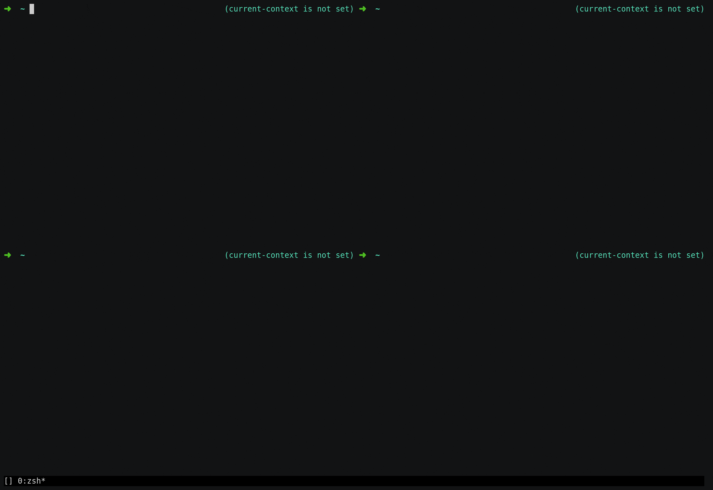

# kontext

## Overview

Set Kubernetes contexts & namespaces per shell and work on multiple clusters at the same time. Stop being afraid of nuking prod (🍿). Setting your context per shell ensures you're less likely to run commands against the wrong cluster in a different shell.



## Usage

```
Usage: kontext [OPTIONS] [CONTEXT]

Options:
  -n, --namespace NAME   Namespace to use.
  --kubeconfig FILE      Path to a kubeconfig file.
  -h, --help             Display this help and exit.
```

### Getting started

#### Install

Grab the latest [release](https://github.com/someone-stole-my-name/kontext/releases) for your platform and move it to a directory in your $PATH.

```
curl -o 'kontext' -L https://github.com/someone-stole-my-name/kontext/releases/download/0.1.0/kontext-aarch64-macos.12 && \
  chmod +x kontext && \
  mv kontext ~/.local/bin/
```

#### Autocompletion

##### Zsh

Set the `kontext` completion code to autoload on startup:

```
kontext completion zsh > "${fpath[1]}/_kontext"
```

Alternatively you can also load the completion code into the current shell:

```
source <(kontext completion zsh)
```
